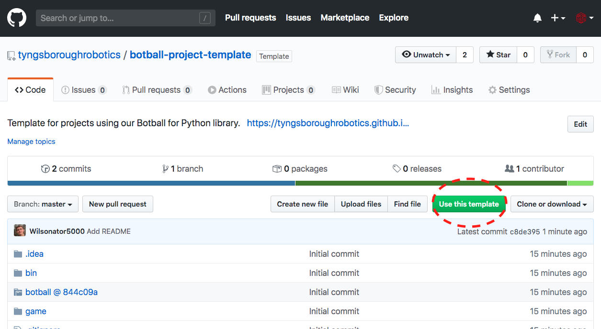

# Botball Project Template

This template is provided by Tyngsborough High School Robotics to make it easier for you to create new projects using our [Botball for Python](https://github.com/tyngsboroughrobotics/botball) library, and is not officially supported by KIPR. If you run into any issues, please [let us know](https://github.com/tyngsboroughrobotics/botball-project-template/issues/new)!

## Usage

1. Sign into your GitHub account or [create a new one](https://github.com/join) if necessary.
2. Navigate back to this page and click the green **"Use this template"** button in the top right:
   
3. Give your project a name and click **"Create repository from template"**. Make public or private, whichever you prefer.
4. Follow the [Botball for Python documentation](https://tyngsboroughrobotics.github.io/botball/) for additional setup information and for instructions on how to use our library.

## Contributing

If you’d like to contribute, please [create an issue or a pull request](https://github.com/tyngsboroughrobotics/botball-project-template/issues/new) and we’ll get back to you shortly. We encourage you to contribute in the form of bug hunting, code patches, and documentation!
